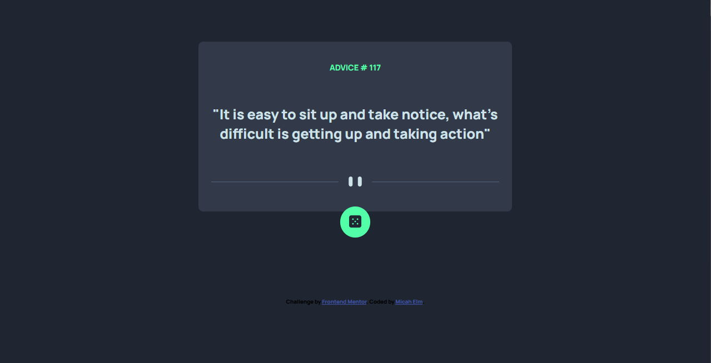

# Advice generator app solution

## Table of contents

- [Overview](#overview)
  - [The challenge](#the-challenge)
  - [API Reference](#api-reference)
  - [Screenshot](#screenshot)
  - [Built with](#built-with)
  - [Continued development](#continued-development)

## Overview

The goal of the project for me:
-Create simple UI frontend project
-GET data from API
-Render data
-Allow users to click a button to GET new advice
-Use CSS further

### The challenge

Users should be able to:

- View the optimal layout for the app depending on their device's screen size
- See hover states for all interactive elements on the page
- Generate a new piece of advice by clicking the dice icon

### API Reference

[Advice Slip](https://api.adviceslip.com/) by Tom Kiss

### Screenshot

### Built with

- Semantic HTML5 markup
- CSS custom properties
- Flexbox
- Mobile-first workflow
- [JavaScript](https://www.javascript.com/)

### Continued development

-Add stored memory session
-Update CSS with some [Styled-Components](https://styled-components.com/)
-Update with [React](https://reactjs.org/)

yourself when you look back on this project in the future.\*\*
